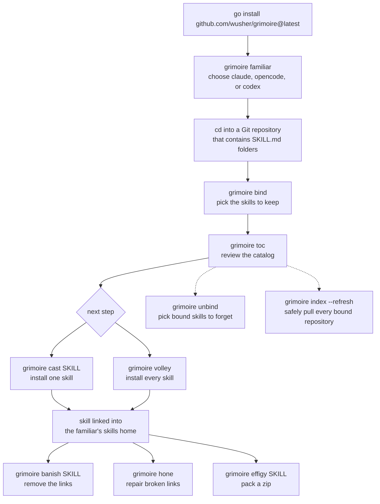

# grimoire


Grimoire finds agent skills in Git repositories, keeps the ones you choose in
one catalog, and links them into your agent: Claude Code, OpenCode, or Codex.

A skill is any folder that contains a `SKILL.md`. The source folders stay in
their repositories. Grimoire only manages selections and symlinks.

```text
⠀⠀⠀⠀⣀⠀⠀⠀⠀⠀⠀⠀⠀⠀⠀⠀⠀⠀⠀⠀⠀⠀⠀⠀⠀⠀⠀⠀
⠀⣠⡾⠛⠛⠛⠛⠛⠛⠛⠛⠛⠻⠿⠿⠷⠶⠶⠶⠶⣶⡀⠀⠀⠀⠀⠀⠀
⢰⡿⠀⠀⠸⣷⠀⠀⠀⡀⠀⠀⠀⠀⠀⠀⠀⠀⢀⡀⠸⣧⠀⠀⠀⠀⠀⠀
⠸⣧⠀⠀⠀⢻⡆⠀⠀⢻⣦⡤⠀⠀⠀⠀⠀⣀⣾⡇⠀⢹⣇⠀⠀⠀⠀⠀
⠀⢿⡄⠀⠀⠈⣿⡀⠀⠀⠙⠿⣶⡤⠀⠀⢠⣾⠟⠁⠀⠀⢻⡆⠀⠀⠀⠀
⠀⠸⡇⠀⠀⠀⢹⣇⠀⠀⡀⠀⠀⠀⠀⠀⠀⠁⢀⠀⠀⡄⠈⢿⡄⠀⠀⠀
⠀⠀⢿⠀⠀⠀⠀⢿⡄⠀⢹⣷⣄⡀⣶⣦⡀⢀⣿⣆⣾⡇⠀⠘⣷⠀⠀⠀
⠀⠀⠘⡇⠀⠀⠀⠸⣷⠀⠀⢻⡿⣿⣿⣿⣿⣿⣿⣿⣿⡇⠀⠀⠸⣆⠀⠀
⠀⠀⠀⣿⡀⠀⠀⠀⢻⡆⠀⠀⠀⠈⢻⣿⠃⠙⢿⡏⠈⠇⠀⠀⠀⢹⡄⠀
⠀⠀⠀⢸⣇⠀⠀⠀⠈⠉⠀⠀⠀⠀⠀⠁⠀⠀⠈⠀⠀⠀⠀⠀⠀⠈⣿⡀
⠀⠀⠀⠀⣿⣀⣴⠾⠛⠛⠛⠛⠛⠛⠛⠛⠛⠛⠛⠿⠿⠿⠷⠶⠶⠶⠾⠷
⠀⠀⠀⠀⢸⡿⠁⣴⣾⣿⣿⣿⣿⣿⣷⣶⣶⣶⣶⣶⣶⣶⣶⣶⣶⠶⠂⠀
⠀⠀⠀⠀⠀⠁⢸⣿⣿⣿⣿⣿⣿⣿⣿⣿⣿⣿⣿⣿⣿⣿⣿⣿⣧⠀⠀⠀
⠀⠀⠀⠀⠀⠀⠈⠉⠉⠉⠉⠉⠉⠉⠙⠛⠛⠛⠛⠛⠛⠛⠛⠛⠛⠀⠀⠀
```

## Install

```sh
go install github.com/wusher/grimoire@latest
```

Or build from this repository (Go 1.24 or later):

```sh
make build     # writes ./grimoire
make install   # installs into GOBIN
```

## How to use it



Quick start:

```sh
grimoire familiar claude     # one time; the first terminal command also asks
cd ~/code/my-repo            # any Git repository with */SKILL.md folders
grimoire bind                # fuzzy picker; or pass names to skip it
grimoire toc                 # browse the catalog
grimoire cast some-skill     # link one skill into your agent
```

The selection is stored in `~/.config/grimoire/bindings.json`, so every other
command works from any directory. Run `bind` again in the same repository to
replace its selection. Run `unbind` from any directory to choose from all bound
skills. Run `index` to list every bound repository and `--refresh` to update
them all.

## Commands

### `grimoire help`

Shows the help page. `-h` and `--help` are aliases.

```text
$ grimoire --help

╓──────────────────────────────────── ❦ ─────────────────────────────────────┐
║                                                                            │
║                              G R I M O I R E                               │
║                     ✦ keeps agent skills in one book ✦                     │
║                                                                            │
║            ──────────────────────── ✦ ────────────────────────             │
║                                                                            │
║                        ⠀⠀⠀⠀⣀⠀⠀⠀⠀⠀⠀⠀⠀⠀⠀⠀⠀⠀⠀⠀⠀⠀⠀⠀⠀⠀⠀⠀                        │
║                        ⠀⣠⡾⠛⠛⠛⠛⠛⠛⠛⠛⠛⠻⠿⠿⠷⠶⠶⠶⠶⣶⡀⠀⠀⠀⠀⠀⠀                        │
║                        ⢰⡿⠀⠀⠸⣷⠀⠀⠀⡀⠀⠀⠀⠀⠀⠀⠀⠀⢀⡀⠸⣧⠀⠀⠀⠀⠀⠀                        │
║                        ⠸⣧⠀⠀⠀⢻⡆⠀⠀⢻⣦⡤⠀⠀⠀⠀⠀⣀⣾⡇⠀⢹⣇⠀⠀⠀⠀⠀                        │
║                        ⠀⢿⡄⠀⠀⠈⣿⡀⠀⠀⠙⠿⣶⡤⠀⠀⢠⣾⠟⠁⠀⠀⢻⡆⠀⠀⠀⠀                        │
║                        ⠀⠸⡇⠀⠀⠀⢹⣇⠀⠀⡀⠀⠀⠀⠀⠀⠀⠁⢀⠀⠀⡄⠈⢿⡄⠀⠀⠀                        │
║                        ⠀⠀⢿⠀⠀⠀⠀⢿⡄⠀⢹⣷⣄⡀⣶⣦⡀⢀⣿⣆⣾⡇⠀⠘⣷⠀⠀⠀                        │
║                        ⠀⠀⠘⡇⠀⠀⠀⠸⣷⠀⠀⢻⡿⣿⣿⣿⣿⣿⣿⣿⣿⡇⠀⠀⠸⣆⠀⠀                        │
║                        ⠀⠀⠀⣿⡀⠀⠀⠀⢻⡆⠀⠀⠀⠈⢻⣿⠃⠙⢿⡏⠈⠇⠀⠀⠀⢹⡄⠀                        │
║                        ⠀⠀⠀⢸⣇⠀⠀⠀⠈⠉⠀⠀⠀⠀⠀⠁⠀⠀⠈⠀⠀⠀⠀⠀⠀⠈⣿⡀                        │
║                        ⠀⠀⠀⠀⣿⣀⣴⠾⠛⠛⠛⠛⠛⠛⠛⠛⠛⠛⠛⠿⠿⠿⠷⠶⠶⠶⠾⠷                        │
║                        ⠀⠀⠀⠀⢸⡿⠁⣴⣾⣿⣿⣿⣿⣿⣷⣶⣶⣶⣶⣶⣶⣶⣶⣶⣶⠶⠂⠀                        │
║                        ⠀⠀⠀⠀⠀⠁⢸⣿⣿⣿⣿⣿⣿⣿⣿⣿⣿⣿⣿⣿⣿⣿⣿⣿⣧⠀⠀⠀                        │
║                        ⠀⠀⠀⠀⠀⠀⠈⠉⠉⠉⠉⠉⠉⠉⠙⠛⠛⠛⠛⠛⠛⠛⠛⠛⠛⠀⠀⠀                        │
║                                                                            │
║   H O W   T O   S A Y   I T ────────────────────────────────────────────   │
║                                                                            │
║      grimoire <command> [arguments]                                        │
║                                                                            │
║   T H E   B O O K ──────────────────────────────────────────────────────   │
║                                                                            │
║      toc | list | ls       Opens the searchable catalog.                   │
║                                                                            │
║   T H E   S P E L L S ──────────────────────────────────────────────────   │
║                                                                            │
║      cast [SKILL]          Installs one bound skill. Without SKILL, opens  │
║                            the tree.                                       │
║      banish [SKILL]        Removes one skill link. Without SKILL, opens    │
║                            the tree.                                       │
║      volley                Installs every skill in the book.               │
║      effigy [SKILL]        Zips one bound skill. Without SKILL, opens a    │
║                            picker.                                         │
║                                                                            │
║   T H E   B I N D I N G ────────────────────────────────────────────────   │
║                                                                            │
║      bind [NAME...]        Chooses skills from this Git repository.        │
║                            Alias: bond.                                    │
║      unbind [SKILL...]     Forgets bound skills. Without SKILL, opens the  │
║                            tree. Alias: unbond.                            │
║      index                 Lists the bound repositories.                   │
║        --refresh           Safely pulls the latest in each.                │
║      familiar [NAME]       Chooses Claude, OpenCode, or Codex.             │
║      hone                  Repairs the links you already installed.        │
║        --dry-run           Shows the report. Changes nothing.              │
║      help | -h | --help    Shows this page.                                │
║                                                                            │
║   W O R T H   K N O W I N G ────────────────────────────────────────────   │
║                                                                            │
║      A bind finds every [skill-name]/SKILL.md below the Git root.          │
║      Full-screen views redraw after a terminal resize.                     │
║      Pass names or paths to skip pickers in scripts.                       │
║      The first interactive command asks you to choose a familiar.          │
║      NO_COLOR=1 turns color off. GRIMOIRE_ICONS=0 turns icons off.         │
║                                                                            │
╙────────────────────── grimoire toc  ·  grimoire cast ──────────────────────┘
```

### `grimoire bind [NAME...]`

Selects skills found in the current Git repository. Names or repository-relative
paths bypass the picker. `bond` is an alias.

```text
$ grimoire bind test-skill

╓──────────────────────────────────── ❦ ─────────────────────────────────────┐
║                                                                            │
║                                  B I N D                                   │
║                        ✦ the book takes your hand ✦                        │
║                                                                            │
║            ──────────────────────── ✦ ────────────────────────             │
║                                                                            │
║                ⠀⠀⠀⠀⠀⠀⠀⠀⠀⠀⠀⠀⠀⠀⠀⠀⠀⠀⠀⠀⠀⠀⠀⠀⠀⠀⠀⠀⠀⠀⠀⠀⠀⠀⠀⠀⠀⢸⡀⠀⠀⠀⠀                 │
║                ⠀⠀⢸⠀⠀⠀⠀⠀⠀⠀⠀⠀⠀⠀⠀⠀⠀⠀⠀⠀⠀⠀⠀⠀⠀⠀⠀⠀⠀⠀⠀⠀⠀⠀⠀⠀⠀⢸⡇⠀⠀⠀⠀                 │
║                ⠀⠀⢸⣄⠀⠀⠀⠀⠀⠀⠀⠀⠀⠀⠀⠀⠀⠀⠀⠀⠀⠀⠀⠀⠀⠀⠀⠀⠀⠀⠀⠀⠀⠀⠀⠀⠀⣸⣧⠀⠀⠀⠀                 │
║                ⠀⠀⠘⣿⣦⡀⠀⠀⠀⠀⠀⠀⠀⠀⠀⠀⠀⠀⠀⠀⠀⠀⠀⠀⠀⠀⠀⠀⠀⠀⠀⠀⠀⠀⣠⣴⣾⣿⣿⠀⠀⠀⠀                 │
║                ⠀⠀⠀⢻⣿⣿⣶⣤⣀⡀⠀⠀⠀⠀⠀⠀⠀⠀⠀⠀⠀⠀⠀⠀⠀⠀⠀⠀⣀⡀⣴⣿⣿⣿⣿⡿⠁⠀⠀⢰⠀                   │
║                ⠀⠀⠀⠀⠻⣿⣿⣿⣿⣿⣦⣤⣀⠀⠀⠀⠀⠀⠀⠀⠀⠀⠀⠀⠀⠀⣠⣾⣿⣷⣿⣿⣿⣿⣿⠁⠀⠀⠀⢨⣇                   │
║                ⣰⠀⠀⠀⠀⠉⢿⣿⣿⣿⣿⣾⣿⣿⣷⣦⣄⡀⠀⠀⠀⠀⠀⠀⠀⢀⣴⣾⣿⣿⣿⣿⣿⣿⣿⣿⣇⠀⠀⠀⢀⣼⣿                 │
║                ⢿⡄⠀⠀⠀⠀⠋⠉⠉⠙⠛⠿⠟⠻⠿⠿⠿⠿⠷⣤⣀⠀⠀⢀⠴⠟⠛⠛⠛⠋⠉⠁⠉⠁⠀⠀⠀⠀⠀⠀⣼⣿⣿                 │
║                ⠘⣿⣶⣄⠀⠀⠀⠀⠀⠀⠀⠀⠀⠀⠀⠀⠀⠀⠀⠀⠈⠀⠀⠀⠀⠀⠀⠀⠀⠀⠀⠀⠀⠀⠀⠀⡀⢰⣄⣿⣿⣿⡇                 │
║                ⠀⠹⣿⣿⣧⣀⣀⢀⠀⠀⠀⠀⠀⠀⠀⠀⠀⠀⠀⠀⠀⠀⠀⠀⠀⠀⠀⠀⠀⠀⠀⠀⠀⢰⣶⣿⣿⣸⣿⣿⣿⡷⠀                 │
║                ⠀⠀⠉⣿⣿⣿⣿⢸⣿⣦⣦⣄⡀⠀⢠⣶⢰⣦⣶⣰⣆⣶⣰⣦⣄⢰⣴⡄⣴⠀⠀⣦⣷⣿⣿⣿⣿⣯⣿⣿⣿⠁⠀                 │
║                ⠀⠀⠀⠸⢿⣿⣿⣿⣿⣿⣿⣿⣷⠀⣼⣿⣿⣿⣿⣿⣿⣿⣿⣿⣿⣾⣿⣿⣿⡇⢸⣿⣿⣿⣿⣿⣿⣿⣿⡟⠁⠀⠀                 │
║                ⠀⠀⠀⠀⠀⠋⣿⣿⣿⣿⣿⣿⣿⡇⣿⣿⣿⣿⣿⣿⣿⣿⣿⣿⣿⣿⣿⣿⣿⣿⢸⣿⣿⣿⣿⣿⡿⣿⠿⠀⠀⠀⠀                 │
║                ⠀⠀⠀⠀⠀⠀⠉⢿⣿⣿⣿⣿⣿⣿⣿⣿⣿⣿⣿⣿⣿⣿⣿⣿⣿⣿⣿⣿⣿⣿⣸⣿⣿⣿⣿⡿⠇⠇⠀⠀⠀⠀⠀                 │
║                ⠀⠀⠀⠀⠀⠀⠀⠈⢿⢹⠘⣿⣿⣿⣿⣿⣿⣿⡟⣿⣿⣿⣿⣿⣿⡟⢹⣿⣿⣿⣿⣿⣿⠹⠛⠁⠀⠀⠀⠀⠀⠀⠀                 │
║                ⠀⠀⠀⠀⠀⠀⠀⠀⠀⠈⠀⠀⠈⠟⠏⢿⢿⢿⢧⠘⣿⢿⣿⡟⠿⡇⠸⣿⠿⢻⡟⠛⠈⠀⠀⠀⠀⠀⠀⠀⠀⠀⠀                 │
║                ⠀⠀⠀⠀⠀⠀⠀⠀⠀⠀⠀⠀⠀⠀⠀⠈⠀⠀⠘⠀⠀⠈⠈⠁⠀⠃⠀⠀⠀⠀⠃⠀⠀⠀⠀⠀⠀⠀⠀⠀⠀⠀⠀                 │
║                                                                            │
║                 the chosen skills now answer from the book                 │
║                   their source stays in this repository                    │
║                  bind again here to change the selection                   │
║                                                                            │
╙───────────────────────── /tmp/opencode/test-repo ──────────────────────────┘

/tmp/opencode/test-repo 1 skill bound
```

### `grimoire unbind [SKILL...]`

Removes selected skills from the catalog. Without arguments, it opens a picker
that contains every bound skill, so the command works from any directory. Names
or repository-relative paths bypass the picker. Source folders and installed
agent links stay. `unbond` is an alias.

```text
$ grimoire unbind
unbind which?
> [ ]   test-skill  A sample skill

arrows move  space marks  right opens  left closes  enter confirms  esc quits
```

### `grimoire index [--refresh]`

Lists every bound repository with its selected skill count. A missing folder is
flagged. `--refresh` pulls the latest in each repository, safely:

1. A missing folder, or a folder that is not a Git repository, fails without
   touching anything.
2. A dirty worktree is left completely alone.
3. A branch without an upstream is skipped.
4. The pull uses `--ff-only`, so a diverged branch fails instead of merging or
   rewriting. Local work is never overwritten.

```text
$ grimoire index

╓──────────────────────────────────── ❦ ─────────────────────────────────────┐
║                                                                            │
║                                 I N D E X                                  │
║                           ✦ every bound folder ✦                           │
║                                                                            │
║            ──────────────────────── ✦ ────────────────────────             │
║                                                                            │
║     I. /tmp/opencode/clone               · · · · · · · · · 1 skill bound   │
║                                                                            │
╙────────────────────────────── 1 repositories ──────────────────────────────┘

$ grimoire index --refresh
/tmp/opencode/clone already up to date

                  0 pulled  ·  1 current
```

### `grimoire toc`

Opens a searchable catalog. Prints the catalog when piped. `list` and `ls` are
aliases.

```text
$ grimoire toc

╓───────────────────────────────────── ❦ ──────────────────────────────────────┐
║                                                                              │
║                               G R I M O I R E                                │
║                            ✦ table of contents ✦                             │
║                                                                              │
║             ──────────────────────── ✦ ────────────────────────              │
║                                                                              │
║     I. ❦ loose leaves                                      0 of 1 installed  │
║          ─────────────────────────────────────────────────────────────────   │
║          test-skill     · ✦  · ✦  · ✦  · ✦  · ✦  · ✦  · ✦  · ✦  · not cast   │
║            A sample skill for the README screenshot.                         │
║                                                                              │
╙──────────────── 0 of 1 installed  ·  ❦  ·  familiar: claude ─────────────────┘
```

### `grimoire familiar [NAME]`

Chooses one agent: `claude`, `opencode`, or `codex`.

```text
$ grimoire familiar claude
the grimoire is bound to Claude Code
/tmp/opencode/claude-home/skills
```

### `grimoire cast [SKILL]`

Installs a bound skill by name or repository path. Without one, opens a picker.

```text
$ grimoire cast test-skill
test-skill installed

                ⠀⠀⠀⠀⠀⠀⠀⠀⠀⠀⠀⠀⠀⠀⠀⠀⠀⠀⠀⠀⠀⠀⠀⠀⢀⠀⠀⠀⠀⠀⠀⠀⠀⠀⠀⠀⠀⠀⠀
                ⠀⠀⠀⠀⠀⠀⠀⠀⠀⠀⠀⠀⠀⠀⠀⠀⠀⠀⠀⢠⡄⠀⠀⠀⣄⣼⣶⠖⠀⠀⠀⠀⠀⠀⠀⠀⠀⠀⠀
                ⠀⠀⠀⠀⠀⠀⠀⠀⠀⠀⠀⠀⠀⠀⠀⠀⠀⠀⠀⠙⠋⣀⠴⠂⠀⠋⠻⠀⠀⠀⠀⠀⠀⠀⠀⠀⠀⣀⠀
                ⠀⠀⠀⠀⠀⠀⠀⠀⠀⠀⠀⠀⠀⠀⠀⣦⡄⠀⣠⠖⠉⠀⠀⠀⠀⠀⠀⠀⠀⠀⠸⣇⣀⣀⣀⠀⠀⠻⠇
                ⠀⠀⠀⠀⠀⠀⠀⠀⠀⠀⠀⠀⠀⠀⠈⠻⠣⠀⠙⢤⣀⡀⢀⣀⣤⠴⠶⠖⠛⠛⠋⠉⠉⠉⣉⣽⠷⠀⠀
                ⠀⠀⠀⠀⠀⠀⠀⠀⠀⠀⠀⠀⠀⠀⠀⠀⠀⠐⠶⢄⣴⡟⠋⠉⢛⠛⠒⠒⠒⠒⠚⠛⢋⠉⢉⣸⣦⠄⠀
                ⠀⠀⠀⠀⠀⠀⠀⠀⠀⠀⠀⠀⠀⠀⠀⠀⠀⠀⠀⠈⠳⠦⣤⣀⣸⣥⣤⣶⣖⣒⣋⣽⠿⠀⠀⠛⠉⠀⠀
                ⠀⠀⠀⠀⠀⠀⠀⠀⠀⠀⠀⠀⠀⠀⠀⠀⠀⠀⠀⠀⠀⠀⠰⢏⣀⣠⢼⠇⠀⠀⠀⠀⠀⠀⠀⠀⠀⠀⠀
                ⠀⠀⠀⠀⠀⠀⠀⠀⠀⠀⠀⠀⠀⠀⠀⠀⠀⠀⠀⠀⠀⣀⣤⡶⠛⠉⠉⠉⠀⠀⠀⠀⠀⠀⠀⠀⠀⠀⠀
                ⠀⠀⠀⠀⠀⠀⠀⠀⠀⠀⠀⠀⠀⠀⠀⠀⠀⢀⣠⡶⠟⠉⠁⠀⠀⠀⠀⠀⠀⠀⠀⠀⠀⠀⠀⠀⠀⠀⠀
                ⠀⠀⠀⡠⠒⠒⠂⠤⢤⡀⠀⠀⠀⢀⣠⡴⠞⠋⠁⠀⠀⠀⠀⠀⠀⠀⠀⠀⠀⠀⠀⠀⠀⠀⠀⠀⠀⠀⠀
                ⠀⣠⠎⠀⠘⣄⣓⠶⡢⢤⣭⣷⠾⠋⠁⠀⠀⠀⠀⠀⠀⠀⠀⠀⠀⠀⠀⠀⠀⠀⠀⠀⠀⠀⠀⠀⠀⠀⠀
                ⠈⠀⠀⠀⠀⠈⣁⣀⣀⣹⠉⠁⠀⠀⠀⠀⠀⠀⠀⠀⠀⠀⠀⠀⠀⠀⠀⠀⠀⠀⠀⠀⠀⠀⠀⠀⠀⠀⠀
                ⠀⠀⣀⠤⠖⠻⠿⠋⠀⠉⠀⠀⠀⠀⠀⠀⠀⠀⠀⠀⠀⠀⠀⠀⠀⠀⠀⠀⠀⠀⠀⠀⠀⠀⠀⠀⠀⠀⠀

                      ──────────── ✦ ────────────

                               test-skill
                              1 installed

             linked into /tmp/opencode/claude-home/skills/
```

### `grimoire banish [SKILL]`

Removes a skill's agent links. Without one, opens a picker. Never touches the
source.

```text
$ grimoire banish test-skill
test-skill removed

                     ⠀⠀⠀⠀⠀⠀⠀⠀⠀⠀⠀⠀⠀⠀⣀⠄⠀⠀⠀⠀⠀⠀⠀⠀⠀⠀⠀⠀⠀⠀
                     ⠀⠀⠀⠀⠀⠀⠀⠀⠀⠀⠀⠀⣠⣾⡏⠀⠀⠀⠀⢀⠀⠀⠀⠀⠀⠀⠀⠀⠀⠀
                     ⠀⠀⠀⠀⠀⠀⠀⠀⣶⡄⠀⢰⣿⣿⣧⠀⠀⠀⠀⣼⣧⠀⠀⢸⡄⠀⠀⠀⠀⠀
                     ⠀⠀⠀⠀⠀⠀⠀⠀⢸⣿⡄⠈⢿⣿⣿⣿⣶⣶⣿⣿⣿⠀⠀⢸⣿⠀⠀⠀⠀⠀
                     ⠀⠀⢀⠀⠀⣠⠀⠀⣸⣿⡇⠀⠀⢻⣿⣿⣿⣿⣿⣿⠏⠀⠀⣼⣿⡇⠀⣀⠀⠀
                     ⠀⢀⣿⠀⢰⣿⣄⣰⣿⣿⣇⠀⠀⠀⣿⣿⣿⣿⣿⣯⣀⣀⣴⣿⣿⡇⢀⣿⡆⠀
                     ⠀⣸⣿⡀⠸⣿⣿⣿⣿⠿⣿⢿⣿⣿⣿⣿⣿⣿⣿⣿⢿⣿⠿⣿⣿⣇⣼⣿⣧⠀
                     ⠀⣿⣿⣷⣄⢿⣿⣿⣿⠀⣿⠀⠉⠻⢿⣿⣿⠿⠛⠁⢸⣿⠀⣿⣿⣿⣿⣿⣿⠀
                     ⠀⢸⣿⣿⣿⣿⣿⣿⣿⠀⣿⠀⠀⠀⠀⣿⡇⠀⠀⠀⢸⣿⠀⣿⣿⣿⣿⣿⡟⠀
                     ⠀⠈⢿⣿⣿⣿⣿⣿⣿⠀⣿⠀⠀⠀⠀⣿⡇⠀⠀⠀⢸⣿⠀⣿⣿⣿⣿⣿⠇⠀
                     ⠀⠀⠀⠻⣿⣿⣿⣿⣿⠀⣿⠀⠀⠀⠀⣿⡇⠀⠀⠀⢸⣿⠀⣿⣿⣿⣿⠏⠀⠀
                     ⠀⠀⠀⠀⠈⠻⣿⣿⣿⠀⠿⣦⣄⠀⠀⣿⡇⠀⢀⣤⣾⠟⠀⣿⣿⡿⠃⠀⠀⠀
                     ⠀⠀⠀⠀⠀⠀⠈⠻⢿⣷⣦⣄⠙⠻⢶⣿⣧⠾⠛⢉⣠⣴⣾⠿⠋⠀⠀⠀⠀⠀
                     ⠀⠀⠀⠀⠀⠀⠀⠀⠀⠉⠛⠿⣿⣷⣦⣄⣠⣴⣾⡿⠟⠋⠁⠀⠀⠀⠀⠀⠀⠀
                     ⠀⠀⠀⠀⠀⠀⠀⠀⠀⠀⠀⠀⠀⠉⠙⠛⠛⠉⠁⠀⠀⠀⠀⠀⠀⠀⠀⠀⠀⠀

                      ──────────── ✦ ────────────

                               test-skill
                               1 removed

               cut from /tmp/opencode/claude-home/skills/
```

### `grimoire volley`

Installs every bound skill. Safe to run repeatedly.

```text
$ grimoire volley
installed 1, skipped 0, failed 0
```

### `grimoire effigy [SKILL]`

Writes `output/NAME.zip` in that skill's repository.

```text
$ grimoire effigy test-skill
test-skill /tmp/opencode/output/test-skill.zip 401 B
```

### `grimoire hone [--dry-run]`

Repairs moved or broken links in the familiar's home.

```text
$ grimoire hone
hone
nothing to repair
```

## Skill layout

Skills may be nested at any depth below the repository root:

```text
my-repo/skills/some-skill/SKILL.md
my-repo/tools/agents/review-code/SKILL.md
```

The picker groups skills by repository path, but installation is flat. A skill
name may be used only once across all bound repositories. `SKILL.md` starts
with frontmatter:

```md
---
name: some-skill
description: Use when a particular job needs doing.
---
```

## Installation rules

Casting a skill creates one absolute symlink in the chosen familiar's home:

```text
~/.claude/skills/some-skill         -> /path/to/repository/.../some-skill
~/.config/opencode/skills/some-skill -> /path/to/repository/.../some-skill
~/.codex/skills/some-skill          -> /path/to/repository/.../some-skill
```

- The familiar choice is stored in `~/.config/grimoire/familiar.json`.
  Changing it affects future commands only; old links stay in place.
- Missing destination directories are created.
- A real directory, file, or foreign symlink holding a name blocks the cast.
  Nothing is overwritten.
- `banish` and `hone` touch only links that Grimoire owns.
- The links are the install state; there is no state database.

`XDG_CONFIG_HOME` controls the config root. `GRIMOIRE_HOME` overrides the
complete Grimoire config directory.

## Development

```sh
make setup   # download dependencies and install golangci-lint
make lint    # formatting and safe lint fixes
make test    # tests with the race detector
make build   # build ./grimoire
```

Run `make help` to see every target.
