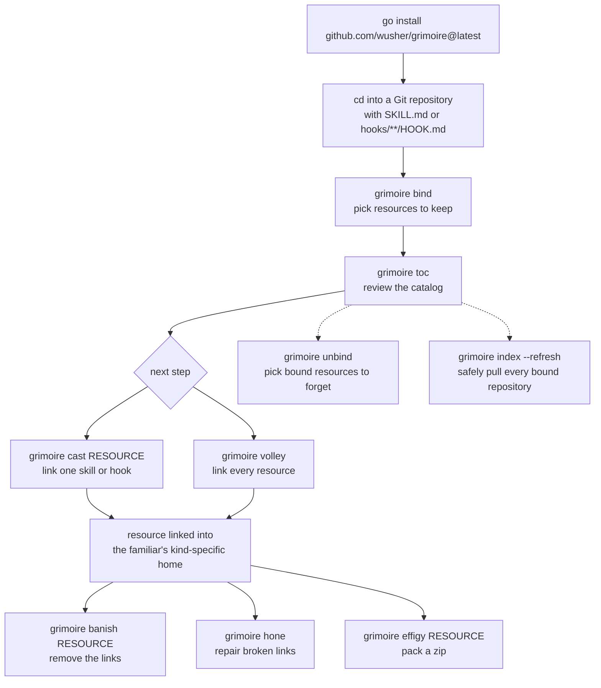

# grimoire


Grimoire finds agent skills and hook folders in Git repositories, keeps the
ones you choose in one catalog, and links them into familiar-specific storage
for Claude Code, OpenCode, Codex, or the shared global location.

A skill is any folder that contains a `SKILL.md`. The source folders stay in
their repositories. A hook is a folder below the repository's top-level
`hooks/` directory containing a regular, non-symlink `HOOK.md`; nested groups
below `hooks/` are supported. Grimoire only manages selections and symlinks.

`HOOK.md` and each familiar's `hooks/` folder are **Grimoire storage
conventions**, not a portable agent hook standard. Beyond requiring a regular
`HOOK.md` marker, Grimoire does not validate hook contents or compatibility,
register hooks, activate hooks, or execute hooks. If you separately activate a
linked hook through an agent or another tool, that hook can execute arbitrary
code with that tool's permissions. Review hook source before activating it.

Binding the first hook is a one-way state-format upgrade: `bindings.json` moves
to the version 2 envelope and remains version 2 even if every hook is later
unbound. Grimoire releases predating hook support, including v0.0.3, cannot read
that hook-bearing/upgraded state. Continue with a hook-aware release after the
upgrade (and back up `bindings.json` before downgrading manually).

```text
⠀⠀⠀⠀⣀⠀⠀⠀⠀⠀⠀⠀⠀⠀⠀⠀⠀⠀⠀⠀⠀⠀⠀⠀⠀⠀⠀⠀
⠀⣠⡾⠛⠛⠛⠛⠛⠛⠛⠛⠛⠻⠿⠿⠷⠶⠶⠶⠶⣶⡀⠀⠀⠀⠀⠀⠀
⢰⡿⠀⠀⠸⣷⠀⠀⠀⡀⠀⠀⠀⠀⠀⠀⠀⠀⢀⡀⠸⣧⠀⠀⠀⠀⠀⠀
⠸⣧⠀⠀⠀⢻⡆⠀⠀⢻⣦⡤⠀⠀⠀⠀⠀⣀⣾⡇⠀⢹⣇⠀⠀⠀⠀⠀
⠀⢿⡄⠀⠀⠈⣿⡀⠀⠀⠙⠿⣶⡤⠀⠀⢠⣾⠟⠁⠀⠀⢻⡆⠀⠀⠀⠀
⠀⠸⡇⠀⠀⠀⢹⣇⠀⠀⡀⠀⠀⠀⠀⠀⠀⠁⢀⠀⠀⡄⠈⢿⡄⠀⠀⠀
⠀⠀⢿⠀⠀⠀⠀⢿⡄⠀⢹⣷⣄⡀⣶⣦⡀⢀⣿⣆⣾⡇⠀⠘⣷⠀⠀⠀
⠀⠀⠘⡇⠀⠀⠀⠸⣷⠀⠀⢻⡿⣿⣿⣿⣿⣿⣿⣿⣿⡇⠀⠀⠸⣆⠀⠀
⠀⠀⠀⣿⡀⠀⠀⠀⢻⡆⠀⠀⠀⠈⢻⣿⠃⠙⢿⡏⠈⠇⠀⠀⠀⢹⡄⠀
⠀⠀⠀⢸⣇⠀⠀⠀⠈⠉⠀⠀⠀⠀⠀⠁⠀⠀⠈⠀⠀⠀⠀⠀⠀⠈⣿⡀
⠀⠀⠀⠀⣿⣀⣴⠾⠛⠛⠛⠛⠛⠛⠛⠛⠛⠛⠛⠿⠿⠿⠷⠶⠶⠶⠾⠷
⠀⠀⠀⠀⢸⡿⠁⣴⣾⣿⣿⣿⣿⣿⣷⣶⣶⣶⣶⣶⣶⣶⣶⣶⣶⠶⠂⠀
⠀⠀⠀⠀⠀⠁⢸⣿⣿⣿⣿⣿⣿⣿⣿⣿⣿⣿⣿⣿⣿⣿⣿⣿⣧⠀⠀⠀
⠀⠀⠀⠀⠀⠀⠈⠉⠉⠉⠉⠉⠉⠉⠙⠛⠛⠛⠛⠛⠛⠛⠛⠛⠛⠀⠀⠀
```

## Install

```sh
go install github.com/wusher/grimoire@latest
```

Or build from this repository (Go 1.24 or later):

```sh
make build     # writes ./grimoire
make install   # installs into GOBIN
```

## How to use it


```mermaid
flowchart TD
    A["go install github.com/wusher/grimoire@latest"] --> C["cd into a Git repository<br/>with SKILL.md or hooks/**/HOOK.md"]
    C --> D["grimoire bind<br/>pick resources to keep"]
    D --> E["grimoire toc<br/>review the catalog"]
    E --> F{next step}
    F --> G["grimoire cast RESOURCE<br/>link one skill or hook"]
    F --> H["grimoire volley<br/>link every resource"]
    G --> J["resource linked into<br/>the familiar's kind-specific home"]
    H --> J
    J --> K["grimoire banish RESOURCE<br/>remove the links"]
    J --> L["grimoire hone<br/>repair broken links"]
    J --> M["grimoire effigy RESOURCE<br/>pack a zip"]
    E -.-> N["grimoire unbind<br/>pick bound resources to forget"]
    E -.-> O["grimoire index --refresh<br/>safely pull every bound repository"]
```

Quick start:

```sh
cd ~/code/my-repo            # a Git repository with SKILL.md or hooks/**/HOOK.md
grimoire bind                # fuzzy picker; or pass names to skip it
grimoire toc                 # browse the catalog
grimoire cast some-skill     # link one skill into your agent
```

Rich output is the default. To use short, plain output for scripts or quiet
terminals, enable boring mode:

```sh
grimoire config boring true
```

Boring mode has no color, icons, art, animation, decorative pages, or
full-screen views. Commands that usually open a picker require a resource name,
path, or qualified selector. Use `grimoire index --refresh` to refresh without
a question. Run
`grimoire config boring false` to restore rich output.

The selection is stored in `~/.config/grimoire/bindings.json`, so every other
command works from any directory. Run `bind` again in the same repository to add
resources. Run `unbind` from any directory to choose resources to remove. Run `index`
to list every bound repository. In a terminal, it then asks if you want to
refresh them. Use `--refresh` to update them without the question.

## Commands

### `grimoire help`

Shows the help page. `-h` and `--help` are aliases.

```text
$ grimoire --help

╓──────────────────────────────────── ❦ ─────────────────────────────────────┐
║                                                                            │
║                              G R I M O I R E                               │
║                    ✦ keeps agent resources in one book ✦                   │
║                                                                            │
║            ──────────────────────── ✦ ────────────────────────             │
║                                                                            │
║                        ⠀⠀⠀⠀⣀⠀⠀⠀⠀⠀⠀⠀⠀⠀⠀⠀⠀⠀⠀⠀⠀⠀⠀⠀⠀⠀⠀⠀                        │
║                        ⠀⣠⡾⠛⠛⠛⠛⠛⠛⠛⠛⠛⠻⠿⠿⠷⠶⠶⠶⠶⣶⡀⠀⠀⠀⠀⠀⠀                        │
║                        ⢰⡿⠀⠀⠸⣷⠀⠀⠀⡀⠀⠀⠀⠀⠀⠀⠀⠀⢀⡀⠸⣧⠀⠀⠀⠀⠀⠀                        │
║                        ⠸⣧⠀⠀⠀⢻⡆⠀⠀⢻⣦⡤⠀⠀⠀⠀⠀⣀⣾⡇⠀⢹⣇⠀⠀⠀⠀⠀                        │
║                        ⠀⢿⡄⠀⠀⠈⣿⡀⠀⠀⠙⠿⣶⡤⠀⠀⢠⣾⠟⠁⠀⠀⢻⡆⠀⠀⠀⠀                        │
║                        ⠀⠸⡇⠀⠀⠀⢹⣇⠀⠀⡀⠀⠀⠀⠀⠀⠀⠁⢀⠀⠀⡄⠈⢿⡄⠀⠀⠀                        │
║                        ⠀⠀⢿⠀⠀⠀⠀⢿⡄⠀⢹⣷⣄⡀⣶⣦⡀⢀⣿⣆⣾⡇⠀⠘⣷⠀⠀⠀                        │
║                        ⠀⠀⠘⡇⠀⠀⠀⠸⣷⠀⠀⢻⡿⣿⣿⣿⣿⣿⣿⣿⣿⡇⠀⠀⠸⣆⠀⠀                        │
║                        ⠀⠀⠀⣿⡀⠀⠀⠀⢻⡆⠀⠀⠀⠈⢻⣿⠃⠙⢿⡏⠈⠇⠀⠀⠀⢹⡄⠀                        │
║                        ⠀⠀⠀⢸⣇⠀⠀⠀⠈⠉⠀⠀⠀⠀⠀⠁⠀⠀⠈⠀⠀⠀⠀⠀⠀⠈⣿⡀                        │
║                        ⠀⠀⠀⠀⣿⣀⣴⠾⠛⠛⠛⠛⠛⠛⠛⠛⠛⠛⠛⠿⠿⠿⠷⠶⠶⠶⠾⠷                        │
║                        ⠀⠀⠀⠀⢸⡿⠁⣴⣾⣿⣿⣿⣿⣿⣷⣶⣶⣶⣶⣶⣶⣶⣶⣶⣶⠶⠂⠀                        │
║                        ⠀⠀⠀⠀⠀⠁⢸⣿⣿⣿⣿⣿⣿⣿⣿⣿⣿⣿⣿⣿⣿⣿⣿⣿⣧⠀⠀⠀                        │
║                        ⠀⠀⠀⠀⠀⠀⠈⠉⠉⠉⠉⠉⠉⠉⠙⠛⠛⠛⠛⠛⠛⠛⠛⠛⠛⠀⠀⠀                        │
║                                                                            │
║   H O W   T O   S A Y   I T ────────────────────────────────────────────   │
║                                                                            │
║      grimoire <command> [arguments]                                        │
║                                                                            │
║   T H E   B O O K ──────────────────────────────────────────────────────   │
║                                                                            │
║      toc | list | ls       Opens the searchable catalog.                   │
║                                                                            │
║   T H E   S P E L L S ──────────────────────────────────────────────────   │
║                                                                            │
║      cast [RESOURCE]       Links one bound skill or hook. Without one,     │
║                            opens the tree.                                 │
║      banish [RESOURCE]     Removes one linked resource. Without one, opens │
║                            the tree.                                       │
║      volley                Links every skill and hook in the book.         │
║      effigy [RESOURCE]     Zips one bound resource. Without one, opens a   │
║                            picker.                                         │
║                                                                            │
║   T H E   B I N D I N G ────────────────────────────────────────────────   │
║                                                                            │
║      bind [SELECTOR...]    Adds skills and hooks from this repository.     │
║                            Alias: bond.                                    │
║      unbind [SELECTOR...]  Forgets bound resources. Without one, opens the │
║                            tree. Alias: unbond.                            │
║      index                 Lists bound repositories and familiar homes.   │
║        --refresh           Refreshes now and repairs managed links.        │
║      familiar [NAME]       Chooses Global, Claude, OpenCode, or Codex.     │
║      config boring [true|false]                                            │
║          Turns minimal, non-interactive output on or off.                  │
║      hone                  Repairs the links you already installed.        │
║        --dry-run           Shows the report. Changes nothing.              │
║      help | -h | --help    Shows this page.                                │
║                                                                            │
║   W O R T H   K N O W I N G ────────────────────────────────────────────   │
║                                                                            │
║      Bind finds SKILL.md anywhere and HOOK.md below top-level hooks/.      │
║      Full-screen views redraw after a terminal resize.                     │
║      Pass names or paths to skip pickers in scripts.                       │
║      Global uses ~/.agents/skills and ~/.agents/hooks by default.          │
║      NO_COLOR=1 turns color off. GRIMOIRE_ICONS=0 turns icons off.         │
║                                                                            │
╙────────────────────── grimoire toc  ·  grimoire cast ──────────────────────┘
```

### `grimoire bind [SELECTOR...]`

Adds skills and hooks found in the current Git repository. Skills are found
recursively anywhere below the Git root; hooks are found recursively only below
its top-level `hooks/` container. Existing bindings remain. The picker includes
a `bind all` choice. Names or repository-relative paths bypass the picker.
`bond` is an alias.

Bare names and paths remain valid when unique. Use `skill:NAME`, `hook:NAME`,
`skill:path/to/name`, or `hook:hooks/group/name` to resolve ambiguity. A skill
and hook may share a basename because their catalogs and install roots differ;
two selected resources of the same kind may not share a basename.

After it updates the binding, the command lists each catalog link it created,
its target, and the changed binding file.

If an older Grimoire catalog-root symlink exists, the command leaves it unchanged.
Add `--replace-legacy-root` to approve its replacement with managed skill links.

```text
$ grimoire bind test-skill

╓──────────────────────────────────── ❦ ─────────────────────────────────────┐
║                                                                            │
║                                  B I N D                                   │
║                        ✦ the book takes your hand ✦                        │
║                                                                            │
║            ──────────────────────── ✦ ────────────────────────             │
║                                                                            │
║                ⠀⠀⠀⠀⠀⠀⠀⠀⠀⠀⠀⠀⠀⠀⠀⠀⠀⠀⠀⠀⠀⠀⠀⠀⠀⠀⠀⠀⠀⠀⠀⠀⠀⠀⠀⠀⠀⢸⡀⠀⠀⠀⠀                 │
║                ⠀⠀⢸⠀⠀⠀⠀⠀⠀⠀⠀⠀⠀⠀⠀⠀⠀⠀⠀⠀⠀⠀⠀⠀⠀⠀⠀⠀⠀⠀⠀⠀⠀⠀⠀⠀⠀⢸⡇⠀⠀⠀⠀                 │
║                ⠀⠀⢸⣄⠀⠀⠀⠀⠀⠀⠀⠀⠀⠀⠀⠀⠀⠀⠀⠀⠀⠀⠀⠀⠀⠀⠀⠀⠀⠀⠀⠀⠀⠀⠀⠀⠀⣸⣧⠀⠀⠀⠀                 │
║                ⠀⠀⠘⣿⣦⡀⠀⠀⠀⠀⠀⠀⠀⠀⠀⠀⠀⠀⠀⠀⠀⠀⠀⠀⠀⠀⠀⠀⠀⠀⠀⠀⠀⠀⣠⣴⣾⣿⣿⠀⠀⠀⠀                 │
║                ⠀⠀⠀⢻⣿⣿⣶⣤⣀⡀⠀⠀⠀⠀⠀⠀⠀⠀⠀⠀⠀⠀⠀⠀⠀⠀⠀⠀⣀⡀⣴⣿⣿⣿⣿⡿⠁⠀⠀⢰⠀                   │
║                ⠀⠀⠀⠀⠻⣿⣿⣿⣿⣿⣦⣤⣀⠀⠀⠀⠀⠀⠀⠀⠀⠀⠀⠀⠀⠀⣠⣾⣿⣷⣿⣿⣿⣿⣿⠁⠀⠀⠀⢨⣇                   │
║                ⣰⠀⠀⠀⠀⠉⢿⣿⣿⣿⣿⣾⣿⣿⣷⣦⣄⡀⠀⠀⠀⠀⠀⠀⠀⢀⣴⣾⣿⣿⣿⣿⣿⣿⣿⣿⣇⠀⠀⠀⢀⣼⣿                 │
║                ⢿⡄⠀⠀⠀⠀⠋⠉⠉⠙⠛⠿⠟⠻⠿⠿⠿⠿⠷⣤⣀⠀⠀⢀⠴⠟⠛⠛⠛⠋⠉⠁⠉⠁⠀⠀⠀⠀⠀⠀⣼⣿⣿                 │
║                ⠘⣿⣶⣄⠀⠀⠀⠀⠀⠀⠀⠀⠀⠀⠀⠀⠀⠀⠀⠀⠈⠀⠀⠀⠀⠀⠀⠀⠀⠀⠀⠀⠀⠀⠀⠀⡀⢰⣄⣿⣿⣿⡇                 │
║                ⠀⠹⣿⣿⣧⣀⣀⢀⠀⠀⠀⠀⠀⠀⠀⠀⠀⠀⠀⠀⠀⠀⠀⠀⠀⠀⠀⠀⠀⠀⠀⠀⠀⢰⣶⣿⣿⣸⣿⣿⣿⡷⠀                 │
║                ⠀⠀⠉⣿⣿⣿⣿⢸⣿⣦⣦⣄⡀⠀⢠⣶⢰⣦⣶⣰⣆⣶⣰⣦⣄⢰⣴⡄⣴⠀⠀⣦⣷⣿⣿⣿⣿⣯⣿⣿⣿⠁⠀                 │
║                ⠀⠀⠀⠸⢿⣿⣿⣿⣿⣿⣿⣿⣷⠀⣼⣿⣿⣿⣿⣿⣿⣿⣿⣿⣿⣾⣿⣿⣿⡇⢸⣿⣿⣿⣿⣿⣿⣿⣿⡟⠁⠀⠀                 │
║                ⠀⠀⠀⠀⠀⠋⣿⣿⣿⣿⣿⣿⣿⡇⣿⣿⣿⣿⣿⣿⣿⣿⣿⣿⣿⣿⣿⣿⣿⣿⢸⣿⣿⣿⣿⣿⡿⣿⠿⠀⠀⠀⠀                 │
║                ⠀⠀⠀⠀⠀⠀⠉⢿⣿⣿⣿⣿⣿⣿⣿⣿⣿⣿⣿⣿⣿⣿⣿⣿⣿⣿⣿⣿⣿⣿⣸⣿⣿⣿⣿⡿⠇⠇⠀⠀⠀⠀⠀                 │
║                ⠀⠀⠀⠀⠀⠀⠀⠈⢿⢹⠘⣿⣿⣿⣿⣿⣿⣿⡟⣿⣿⣿⣿⣿⣿⡟⢹⣿⣿⣿⣿⣿⣿⠹⠛⠁⠀⠀⠀⠀⠀⠀⠀                 │
║                ⠀⠀⠀⠀⠀⠀⠀⠀⠀⠈⠀⠀⠈⠟⠏⢿⢿⢿⢧⠘⣿⢿⣿⡟⠿⡇⠸⣿⠿⢻⡟⠛⠈⠀⠀⠀⠀⠀⠀⠀⠀⠀⠀                 │
║                ⠀⠀⠀⠀⠀⠀⠀⠀⠀⠀⠀⠀⠀⠀⠀⠈⠀⠀⠘⠀⠀⠈⠈⠁⠀⠃⠀⠀⠀⠀⠃⠀⠀⠀⠀⠀⠀⠀⠀⠀⠀⠀⠀                 │
║                                                                            │
║                the chosen resources now answer from the book               │
║                   their source stays in this repository                    │
║                  bind again here to add more resources                     │
║                                                                            │
╙───────────────────────── /tmp/opencode/test-repo ──────────────────────────┘

/tmp/opencode/test-repo 1 skill bound
```

### `grimoire unbind [SELECTOR...]`

Removes selected skills or hooks from the catalog. Without arguments, it opens
a picker that contains every bound resource, so the command works from any
directory. Names
or repository-relative paths bypass the picker. Source folders and installed
agent links stay. `unbond` is an alias.

Use `--replace-legacy-root` to approve replacement of an older catalog-root
symlink during unbind.

```text
$ grimoire unbind
unbind which?
> [ ]   test-skill  A sample skill

arrows move  space marks  right opens  left closes  enter confirms  esc quits
```

### `grimoire index [--refresh]`

Lists every bound repository and every familiar's `skills/` and `hooks/` homes.
For each familiar, it shows how many bound resources are installed, reports
blocked destinations, and lists verified installed links. It also reports
missing resources or broken catalog
links. In a terminal, `index` asks if you want to refresh. `--refresh` starts the
refresh without the question.

Refresh also repairs managed catalog and installed links. It follows a
Git-detected skill or hook path rename when its definition is unchanged apart
from its top-level name. Bind and healthy refreshes record the repository
identity. If that repository folder is later renamed in the same parent folder,
refresh updates the binding. The pull remains safe:

**Activated-hook warning:** refresh can fast-forward source code used by hooks
that you separately activated in an agent or another tool. That can change
executable behavior without another Grimoire review or activation step. Review
incoming repository changes before running `index --refresh` when activated
hooks point into that repository.

1. A missing folder, or a folder that is not a Git repository, fails without
   touching anything.
2. A dirty worktree is left completely alone.
3. A branch without an upstream is skipped.
4. The pull uses `--ff-only`, so a diverged branch fails instead of merging or
   rewriting. Local work is never overwritten.

```text
$ grimoire index

╓──────────────────────────────────── ❦ ─────────────────────────────────────┐
║                                                                            │
║                                 I N D E X                                  │
║                    ✦ repositories and familiar homes ✦                    │
║                                                                            │
║            ──────────────────────── ✦ ────────────────────────             │
║                                                                            │
║     I. /tmp/opencode/clone               · · · · · · · · · 1 skill bound   │
║                                                                            │
╙────────────────────────────── 1 repositories ──────────────────────────────┘

refresh repositories now? [y/N]

$ grimoire index --refresh
/tmp/opencode/clone already up to date

                  0 pulled  ·  1 current
```

### `grimoire toc`

Opens a searchable catalog. Search terms must match a name, group, or individual
description word. Dense fuzzy matches and one-character typos are accepted;
sparse matches across a long description are not. The command prints the
catalog when piped. `list` and `ls` are aliases.

```text
$ grimoire toc

╓───────────────────────────────────── ❦ ──────────────────────────────────────┐
║                                                                              │
║                               G R I M O I R E                                │
║                            ✦ table of contents ✦                             │
║                                                                              │
║             ──────────────────────── ✦ ────────────────────────              │
║                                                                              │
║     I. ❦ loose leaves                                      0 of 1 installed  │
║          ─────────────────────────────────────────────────────────────────   │
║          test-skill     · ✦  · ✦  · ✦  · ✦  · ✦  · ✦  · ✦  · ✦  · not cast   │
║            A sample skill for the README screenshot.                         │
║                                                                              │
╙──────────────── 0 of 1 installed  ·  ❦  ·  familiar: claude ─────────────────┘
```

### `grimoire familiar [NAME]`

Chooses resource homes: `global`, `claude`, `opencode`, or `codex`. The default
is `global`, which links into `~/.agents/skills` and `~/.agents/hooks`.

```text
$ grimoire familiar claude
the grimoire is bound to Claude Code
/tmp/opencode/claude-home/skills
```

### `grimoire config boring [true|false]`

Shows or changes the persistent output mode. `grimoire config` shows the
current value. `grimoire config boring` enables boring mode. The values
`true` and `false` are case-sensitive.

```text
$ grimoire config
boring=false
$ grimoire config boring true
boring=true
```

### `grimoire cast [RESOURCE]`

Links a bound skill or hook by name, repository path, or qualified selector.
Without one, opens a picker. Hook links are storage only and do not activate
hooks.

```text
$ grimoire cast test-skill
test-skill installed

                ⠀⠀⠀⠀⠀⠀⠀⠀⠀⠀⠀⠀⠀⠀⠀⠀⠀⠀⠀⠀⠀⠀⠀⠀⢀⠀⠀⠀⠀⠀⠀⠀⠀⠀⠀⠀⠀⠀⠀
                ⠀⠀⠀⠀⠀⠀⠀⠀⠀⠀⠀⠀⠀⠀⠀⠀⠀⠀⠀⢠⡄⠀⠀⠀⣄⣼⣶⠖⠀⠀⠀⠀⠀⠀⠀⠀⠀⠀⠀
                ⠀⠀⠀⠀⠀⠀⠀⠀⠀⠀⠀⠀⠀⠀⠀⠀⠀⠀⠀⠙⠋⣀⠴⠂⠀⠋⠻⠀⠀⠀⠀⠀⠀⠀⠀⠀⠀⣀⠀
                ⠀⠀⠀⠀⠀⠀⠀⠀⠀⠀⠀⠀⠀⠀⠀⣦⡄⠀⣠⠖⠉⠀⠀⠀⠀⠀⠀⠀⠀⠀⠸⣇⣀⣀⣀⠀⠀⠻⠇
                ⠀⠀⠀⠀⠀⠀⠀⠀⠀⠀⠀⠀⠀⠀⠈⠻⠣⠀⠙⢤⣀⡀⢀⣀⣤⠴⠶⠖⠛⠛⠋⠉⠉⠉⣉⣽⠷⠀⠀
                ⠀⠀⠀⠀⠀⠀⠀⠀⠀⠀⠀⠀⠀⠀⠀⠀⠀⠐⠶⢄⣴⡟⠋⠉⢛⠛⠒⠒⠒⠒⠚⠛⢋⠉⢉⣸⣦⠄⠀
                ⠀⠀⠀⠀⠀⠀⠀⠀⠀⠀⠀⠀⠀⠀⠀⠀⠀⠀⠀⠈⠳⠦⣤⣀⣸⣥⣤⣶⣖⣒⣋⣽⠿⠀⠀⠛⠉⠀⠀
                ⠀⠀⠀⠀⠀⠀⠀⠀⠀⠀⠀⠀⠀⠀⠀⠀⠀⠀⠀⠀⠀⠀⠰⢏⣀⣠⢼⠇⠀⠀⠀⠀⠀⠀⠀⠀⠀⠀⠀
                ⠀⠀⠀⠀⠀⠀⠀⠀⠀⠀⠀⠀⠀⠀⠀⠀⠀⠀⠀⠀⠀⣀⣤⡶⠛⠉⠉⠉⠀⠀⠀⠀⠀⠀⠀⠀⠀⠀⠀
                ⠀⠀⠀⠀⠀⠀⠀⠀⠀⠀⠀⠀⠀⠀⠀⠀⠀⢀⣠⡶⠟⠉⠁⠀⠀⠀⠀⠀⠀⠀⠀⠀⠀⠀⠀⠀⠀⠀⠀
                ⠀⠀⠀⡠⠒⠒⠂⠤⢤⡀⠀⠀⠀⢀⣠⡴⠞⠋⠁⠀⠀⠀⠀⠀⠀⠀⠀⠀⠀⠀⠀⠀⠀⠀⠀⠀⠀⠀⠀
                ⠀⣠⠎⠀⠘⣄⣓⠶⡢⢤⣭⣷⠾⠋⠁⠀⠀⠀⠀⠀⠀⠀⠀⠀⠀⠀⠀⠀⠀⠀⠀⠀⠀⠀⠀⠀⠀⠀⠀
                ⠈⠀⠀⠀⠀⠈⣁⣀⣀⣹⠉⠁⠀⠀⠀⠀⠀⠀⠀⠀⠀⠀⠀⠀⠀⠀⠀⠀⠀⠀⠀⠀⠀⠀⠀⠀⠀⠀⠀
                ⠀⠀⣀⠤⠖⠻⠿⠋⠀⠉⠀⠀⠀⠀⠀⠀⠀⠀⠀⠀⠀⠀⠀⠀⠀⠀⠀⠀⠀⠀⠀⠀⠀⠀⠀⠀⠀⠀⠀

                      ──────────── ✦ ────────────

                               test-skill
                              1 installed

             linked into /tmp/opencode/claude-home/skills/
```

### `grimoire banish [RESOURCE]`

Removes a resource's familiar links. Without one, opens a picker. Never touches the
source.

```text
$ grimoire banish test-skill
test-skill removed

                     ⠀⠀⠀⠀⠀⠀⠀⠀⠀⠀⠀⠀⠀⠀⣀⠄⠀⠀⠀⠀⠀⠀⠀⠀⠀⠀⠀⠀⠀⠀
                     ⠀⠀⠀⠀⠀⠀⠀⠀⠀⠀⠀⠀⣠⣾⡏⠀⠀⠀⠀⢀⠀⠀⠀⠀⠀⠀⠀⠀⠀⠀
                     ⠀⠀⠀⠀⠀⠀⠀⠀⣶⡄⠀⢰⣿⣿⣧⠀⠀⠀⠀⣼⣧⠀⠀⢸⡄⠀⠀⠀⠀⠀
                     ⠀⠀⠀⠀⠀⠀⠀⠀⢸⣿⡄⠈⢿⣿⣿⣿⣶⣶⣿⣿⣿⠀⠀⢸⣿⠀⠀⠀⠀⠀
                     ⠀⠀⢀⠀⠀⣠⠀⠀⣸⣿⡇⠀⠀⢻⣿⣿⣿⣿⣿⣿⠏⠀⠀⣼⣿⡇⠀⣀⠀⠀
                     ⠀⢀⣿⠀⢰⣿⣄⣰⣿⣿⣇⠀⠀⠀⣿⣿⣿⣿⣿⣯⣀⣀⣴⣿⣿⡇⢀⣿⡆⠀
                     ⠀⣸⣿⡀⠸⣿⣿⣿⣿⠿⣿⢿⣿⣿⣿⣿⣿⣿⣿⣿⢿⣿⠿⣿⣿⣇⣼⣿⣧⠀
                     ⠀⣿⣿⣷⣄⢿⣿⣿⣿⠀⣿⠀⠉⠻⢿⣿⣿⠿⠛⠁⢸⣿⠀⣿⣿⣿⣿⣿⣿⠀
                     ⠀⢸⣿⣿⣿⣿⣿⣿⣿⠀⣿⠀⠀⠀⠀⣿⡇⠀⠀⠀⢸⣿⠀⣿⣿⣿⣿⣿⡟⠀
                     ⠀⠈⢿⣿⣿⣿⣿⣿⣿⠀⣿⠀⠀⠀⠀⣿⡇⠀⠀⠀⢸⣿⠀⣿⣿⣿⣿⣿⠇⠀
                     ⠀⠀⠀⠻⣿⣿⣿⣿⣿⠀⣿⠀⠀⠀⠀⣿⡇⠀⠀⠀⢸⣿⠀⣿⣿⣿⣿⠏⠀⠀
                     ⠀⠀⠀⠀⠈⠻⣿⣿⣿⠀⠿⣦⣄⠀⠀⣿⡇⠀⢀⣤⣾⠟⠀⣿⣿⡿⠃⠀⠀⠀
                     ⠀⠀⠀⠀⠀⠀⠈⠻⢿⣷⣦⣄⠙⠻⢶⣿⣧⠾⠛⢉⣠⣴⣾⠿⠋⠀⠀⠀⠀⠀
                     ⠀⠀⠀⠀⠀⠀⠀⠀⠀⠉⠛⠿⣿⣷⣦⣄⣠⣴⣾⡿⠟⠋⠁⠀⠀⠀⠀⠀⠀⠀
                     ⠀⠀⠀⠀⠀⠀⠀⠀⠀⠀⠀⠀⠀⠉⠙⠛⠛⠉⠁⠀⠀⠀⠀⠀⠀⠀⠀⠀⠀⠀

                      ──────────── ✦ ────────────

                               test-skill
                               1 removed

               cut from /tmp/opencode/claude-home/skills/
```

### `grimoire volley`

Links every bound skill and hook. Safe to run repeatedly. Rich interactive runs show
the fireworks animation even when every resource is already linked. The drawing
scales with the terminal and stays centered when it is resized; press any key to
skip it.

```text
$ grimoire volley
test-skill installed
installed 1, skipped 0, failed 0
```

### `grimoire effigy [RESOURCE]`

Writes `output/NAME.zip` for a skill and `output/hooks/NAME.zip` for a hook in
that resource's repository. The per-kind destinations prevent a same-name
skill and hook from overwriting one another. Hook folders use the same archive
rules as skills.

```text
$ grimoire effigy test-skill
packed test-skill to /tmp/opencode/output/test-skill.zip (401 B)
```

### `grimoire hone [--dry-run]`

Repairs moved or broken links in every known familiar `skills/` and `hooks/` home.

```text
$ grimoire hone
hone
nothing to repair
```

## Resource layout

Skills may be nested at any depth below the repository root:

```text
my-repo/skills/some-skill/SKILL.md
my-repo/tools/agents/review-code/SKILL.md
my-repo/hooks/preflight/HOOK.md
my-repo/hooks/git/pre-commit/HOOK.md
```

The picker groups resources by repository path, but installation is flat within
each kind. A basename may be used only once per kind across all bound
repositories. A directory may contain both markers. `SKILL.md` and `HOOK.md` may start
with frontmatter:

```md
---
name: some-skill
description: Use when a particular job needs doing.
---
```

## Installation rules

Casting creates one absolute symlink in the chosen familiar's per-kind home.
Catalog links use `$GRIMOIRE_HOME/skills/NAME` and
`$GRIMOIRE_HOME/hooks/NAME`; installed links use:

```text
~/.agents/skills/some-skill        -> /path/to/repository/.../some-skill
~/.claude/skills/some-skill         -> /path/to/repository/.../some-skill
~/.config/opencode/skills/some-skill -> /path/to/repository/.../some-skill
~/.codex/skills/some-skill          -> /path/to/repository/.../some-skill
~/.agents/hooks/some-hook           -> /path/to/repository/hooks/.../some-hook
~/.claude/hooks/some-hook           -> /path/to/repository/hooks/.../some-hook
~/.config/opencode/hooks/some-hook  -> /path/to/repository/hooks/.../some-hook
~/.codex/hooks/some-hook            -> /path/to/repository/hooks/.../some-hook
```

- A non-default familiar choice is stored in `~/.config/grimoire/familiar.json`.
  Changing it affects future commands only; old links stay in place.
- Output options are stored in `~/.config/grimoire/config.json`.
- Missing destination directories are created.
- A real directory, file, or foreign symlink holding a name blocks the cast.
  Nothing is overwritten.
- `banish` and `hone` touch only links that Grimoire owns.
- The links are the install state; there is no state database.

`XDG_CONFIG_HOME` controls the config root. `GRIMOIRE_HOME` overrides the
complete Grimoire config directory.

## Development

```sh
make setup   # download dependencies and install golangci-lint
make lint    # formatting and safe lint fixes
make test    # tests with the race detector
make build   # build ./grimoire
```

Run `make help` to see every target.
